<!-- ========================================================= -->
<!-- HEADER -->
<!-- ========================================================= -->

  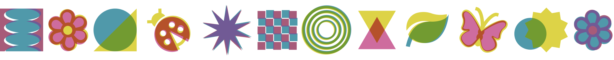

  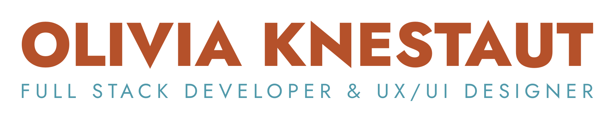

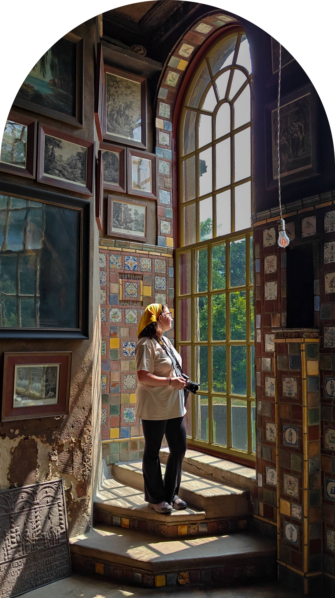

As a **UX/UI Designer** and **Full Stack Developer**, I am passionate about creativity, problem-solving, and inclusive design. One of my main goals is to get involved with accessibility in media. I want to promote the consideration of a range of disabilities throughout every stage of the design and development process.

 

Currently, I am pursuing a **Bachelor of Science in User Experience & Interaction Design (UXID)** with a **Minor in Graphic Design** at **Drexel University**. With this degree I hope to build towards a mastery of full-stack development and design to help add meaningful, accessible media to the world.

 

Beyond the screen, I find inspiration in the natural world. Whether I'm photographing my way across America's National Parks or nurturing my ever-growing collection of houseplants, I love connecting with nature and capturing its beauty.

&nbsp;

&nbsp;

&nbsp;

&nbsp;

<!-- ========================================================= -->
<!-- CURRENTLY INVOLVED WITH -->
<!-- ========================================================= -->

  

  

 

<a href="https://www.drexelcab.com/">
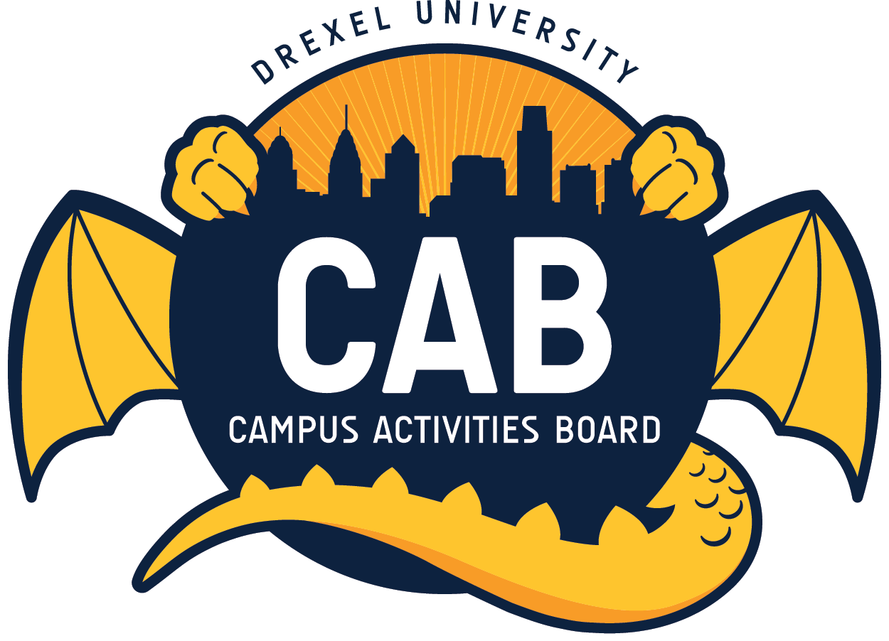
</a>
&nbsp;

&nbsp;
<a href="https://www.instagram.com/drexeldragonfly/">
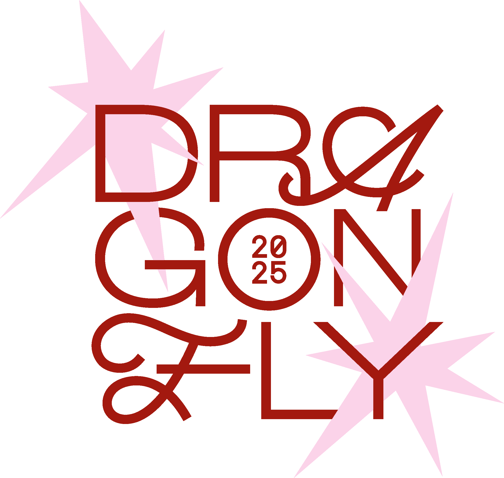
</a>

<a href="https://rewritingthecode.org/">
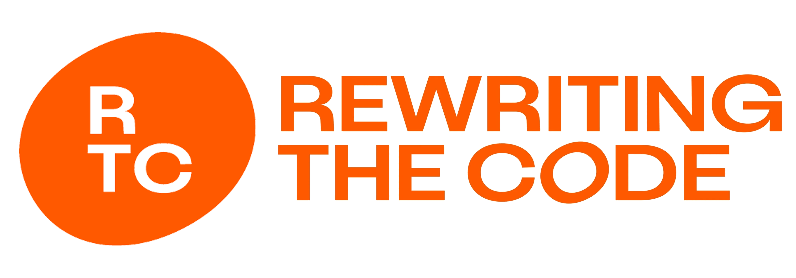
</a>
&nbsp;

&nbsp;
<a href="https://girlswhocode.com/">
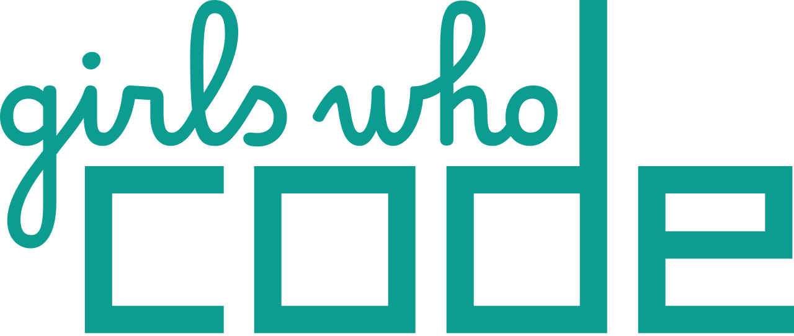
</a>

 

<!-- ========================================================= -->
<!-- LATELY I'VE BEEN... -->
<!-- ========================================================= -->

 

  

 

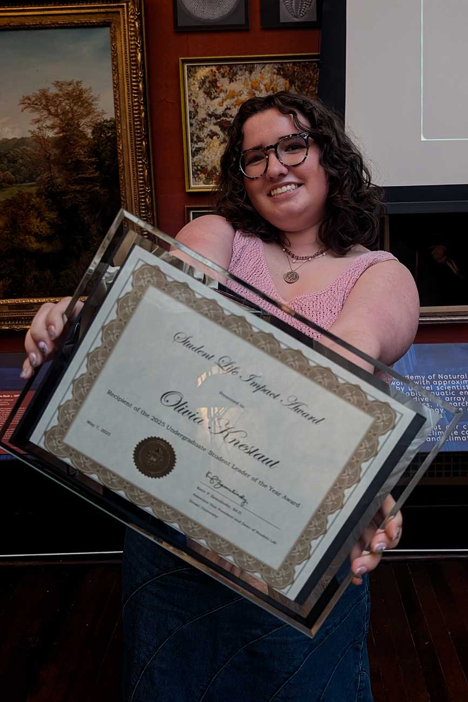
&nbsp;
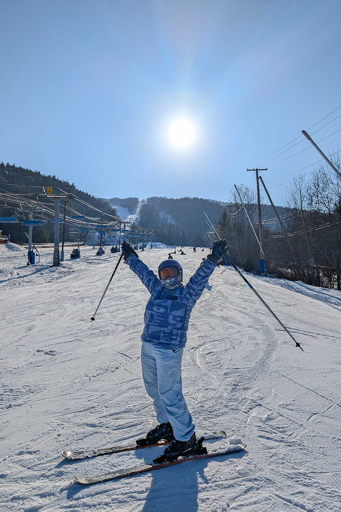
&nbsp;
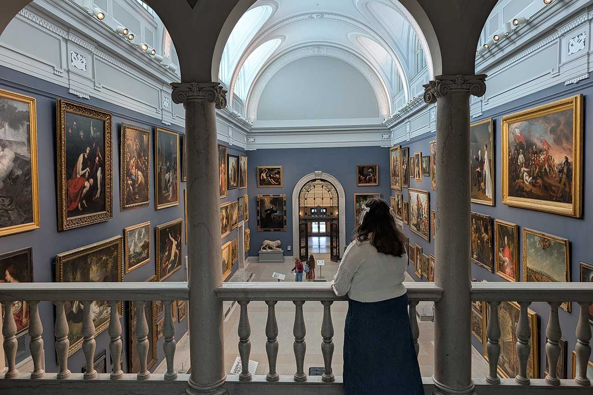

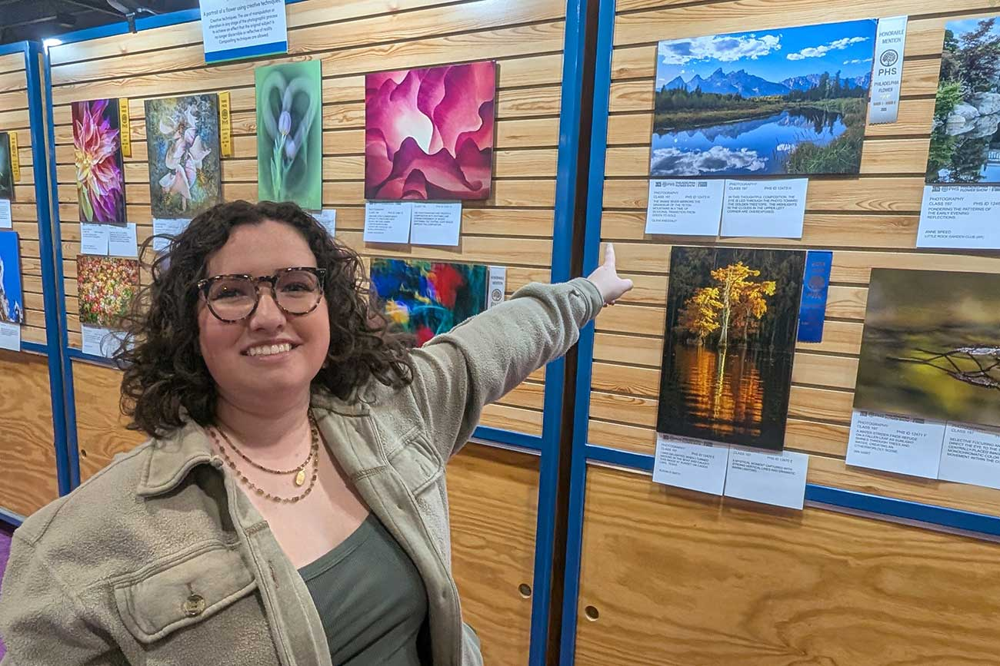
&nbsp;
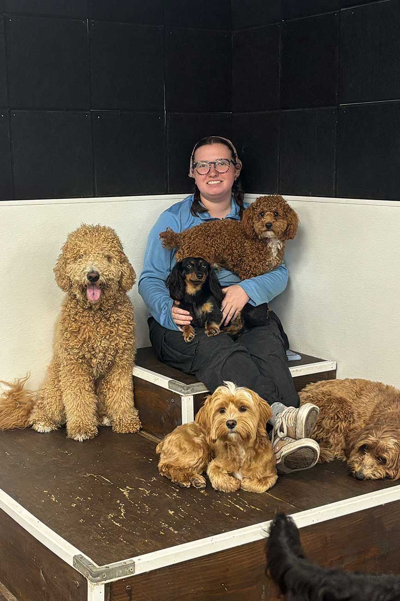
&nbsp;
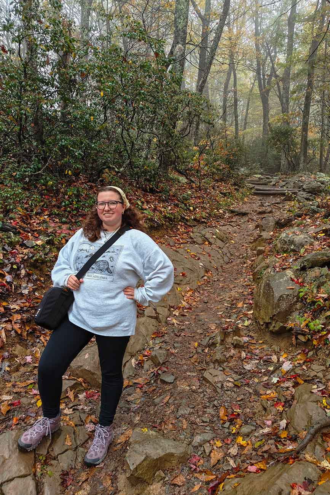

<!-- ========================================================= -->
<!-- MAYBE YOU SAW ME AT... -->
<!-- ========================================================= -->

 

  

 

&nbsp;

&nbsp;

&nbsp;

 

  

